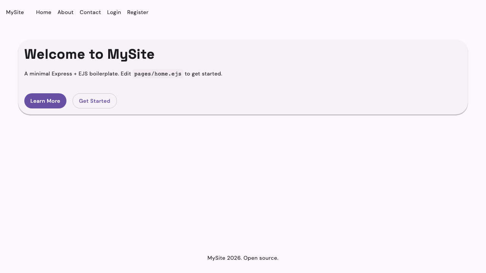
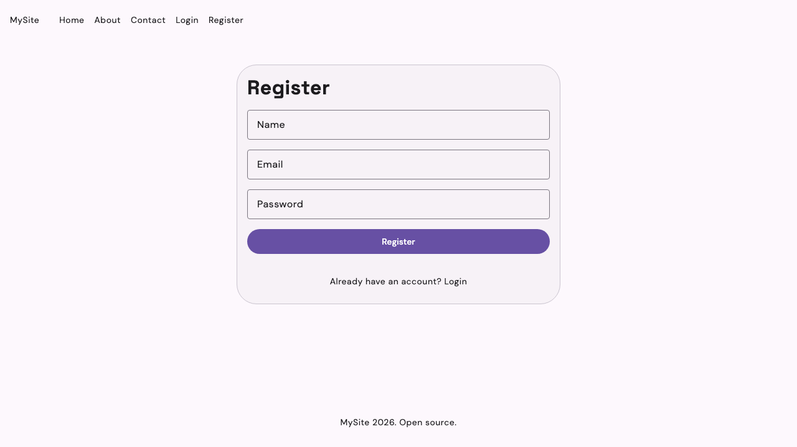
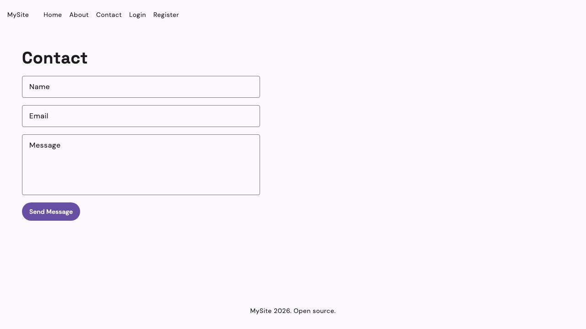

# TemplatrJS

A minimal Node.js boilerplate for quick prototyping — auth, a contact form, a database, and a UI framework included out of the box.

  

**Stack:** Node.js 18+ · Express · EJS · SQLite via Sequelize · Passport.js · Beer CSS

> **Note:** This is a prototyping boilerplate, not production-ready. Edge cases are untested.

## Setup

```
npm install
npm run init    # generates .env with a session secret (required for auth)
npm run dev
```

Then open http://localhost:3000

Use `npm run dev` instead of `npm start` to auto-restart on file changes (uses Node's built-in `--watch`).

## How Do I Use It?

90% of the time you work in the `app/` folder. Public assets (CSS, JavaScript, images) go in `public/`.

### Creating and Editing Views

`app/views/pages/` contains the EJS page files — Express looks here when rendering pages.  
`app/views/components/` is for partials (nav, footer, head) that you include across pages.

If you're not familiar with EJS, it's a simple HTML templating language. [Learn more about EJS here](https://ejs.co/).

### Adding Routes

Routes live in `app/routes.js`. Add a new route like this:

```javascript
app.get('/yourpage', (req, res) => {
  res.render('yourpage', { title: 'Your Page' });
});
```

For POST routes or anything with meaningful logic, consider extracting it into a controller (see [Controllers](#controllers)).

### Working With CSS, JavaScript and Images

#### CSS: Beer CSS

TemplatrJS uses [Beer CSS](https://www.beercss.com/) — a lightweight CSS framework built on Material Design 3. It provides components, layout utilities, and a consistent design system out of the box.

**Key things to know:**
- Use Beer CSS utility classes directly on HTML elements — e.g. `class="round border"`, `class="row gap"`, `class="responsive"`
- Forms use floating labels: put the `<label>` *after* the `<input>`, not before, and wrap both in `<div class="field label border">`
- `<b>` tags are styled as chips/badges by Beer CSS — use `<strong>` for bold text instead
- `<main class="responsive">` constrains page content to a readable max-width and centres it

Add custom overrides in `public/css/style.css`. It loads after Beer CSS so your rules take precedence.

See the [Beer CSS docs](https://www.beercss.com/) for the full component reference.

### Working With Models and SQL

TemplatrJS uses [Sequelize](https://sequelize.org/) as its ORM.

#### Create a Table

Define models in `app/models/`. See `models/message.js` and `models/user.js` for examples.

```javascript
const Person = db.define('Person', {
    name: DataTypes.STRING,
    email: DataTypes.STRING,
});
```

Register the model in `app/models/index.js` so the rest of the app can use it:

```javascript
const Person = require('./person');
module.exports = { db, Person, ... };
```

Notes:
- Sequelize is only set up for SQLite, as TemplatrJS is designed for prototyping. It does support other databases — see the [Sequelize docs](https://sequelize.org/docs/v7/category/databases/).
- To avoid writing permanently to a file during development, set `storage` in `db.js` to `':memory:'` — data resets on every restart.

### Controllers

Controllers are entirely optional. For quick prototyping you can put logic directly in `routes.js`. When that becomes messy, extract it into a file in `app/controllers/`. See `app/controllers/contactController.js` for an example.

### Handling Logins With Passport.js

Passport.js is set up, but you'll need to run `npm run init` to generate a `.env` file with a session secret. If you don't need auth, feel free to delete it — nothing depends on it.

Passport.js supports many login strategies, but TemplatrJS only includes email/password out of the box. See the [Passport.js docs](https://www.passportjs.org/) for other strategies.

### Services

`app/services/` is the recommended place for external API calls and business logic that doesn't belong in a controller or model. See `app/services/jsonplaceholder.api.ts` for an example.

### Working With Code Outside `app/` and `public/`

Code outside these folders is related to basic setup: `server.js`, `db.js`, `passport.js`, and `settings.ts`.

## Structure

```
app/
    routes.js              routes
    middleware.js          session and Passport.js setup
    views/                 EJS template files
        pages/
            home.ejs
            about.ejs
            contact.ejs
            login.ejs
            register.ejs
        components/
            head.ejs
            nav.ejs
            footer.ejs
    models/                Sequelize table definitions
        message.js
        user.js
        index.js
    controllers/           optional: extract logic out of routes.js
    services/              optional: API calls and external integrations
public/
    css/style.css          custom CSS overrides (loads after Beer CSS)
```

## Adding a Page

1. Create `app/views/pages/yourpage.ejs`, using the same partial includes as `about.ejs`.
2. Add a route in `routes.js`: `app.get('/yourpage', (req, res) => res.render('yourpage', { title: 'Your Page' }));`
3. Add a link in `nav.ejs`.

## Contact Form

`POST /contact` saves the submission to the database and re-renders the page with a success message. Swap the handler in `routes.js` for real processing (send an email, call an API, etc.) when you're ready to go beyond prototype stage.
